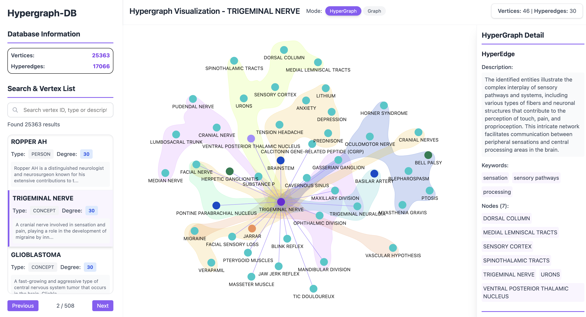

<div align="center">
  
  
  <h1>Hypergraph-DB</h1>
  <p><em>A Lightweight, Fast, and Modern Hypergraph Database with Hypergraph Visualization.</em></p>

  <p>
    <a href="https://pypi.org/project/hypergraph-db/">
      
    </a>
    <a href="https://github.com/iMoonLab/Hypergraph-DB/blob/main/LICENSE">
      
    </a>
    <a href="https://github.com/iMoonLab/Hypergraph-DB">
      
    </a>
  </p>
  
  <p>
    <a href="https://img.shields.io/pypi/pyversions/hypergraph-db">
      
    </a>
    <a href="https://github.com/iMoonLab/Hypergraph-DB/actions">
      
    </a>
    <a href="https://github.com/iMoonLab/Hypergraph-DB">
      
    </a>
  </p>

  <p>
    <a href="#-features">Features</a> •
    <a href="#-quick-start">Quick Start</a> •
    <a href="#-installation">Installation</a> •
    <a href="#-documentation">Documentation</a> •
    <a href="#-examples">Examples</a>
  </p>
</div>

---

## 🚀 About

**Hypergraph-DB** is a lightweight, flexible, and high-performance Python library for modeling and managing **hypergraphs** — advanced graph structures where edges (hyperedges) can connect any number of vertices. Unlike traditional graphs that only support pairwise relationships, hypergraphs naturally represent complex multi-way relationships found in real-world scenarios.

### 🎯 Why Hypergraphs?

<div align="center">
  
</div>

**Traditional graphs** can only model pairwise relationships:
```
Alice ←→ Bob, Bob ←→ Charlie, Alice ←→ Charlie (3 separate edges)
```

**Hypergraphs** naturally model group relationships:
```
{Alice, Bob, Charlie} — working together on a project (1 hyperedge)
```

### 🌟 Perfect for

- **📚 Academic Collaborations**: Research papers with multiple co-authors
- **👥 Social Networks**: Group activities and multi-party interactions  
- **🛒 E-commerce**: Shopping baskets with multiple items
- **🧬 Bioinformatics**: Protein interactions and genetic networks
- **🏗️ Knowledge Graphs**: Complex entity relationships

## ✨ Features

| Feature | Description |
|---------|-------------|
| 🚀 **High Performance** | Handle millions of vertices and edges efficiently |
| 🔗 **Native Hypergraph Support** | True multi-way relationships, not decomposed binary edges |
| 💾 **Persistence** | Save/load with pickle, JSON, or custom formats |
| 🎨 **Interactive Visualization** | Built-in web-based visualization with D3.js |
| 🔍 **Rich Queries** | Neighbor queries, degree calculations, community detection |
| 📊 **Flexible Attributes** | Rich metadata for both vertices and hyperedges |
| 🛠️ **Developer Friendly** | Modern Python with type hints, comprehensive docs |
| ⚡ **Modern Tooling** | Built with uv, tested, and well-documented |

## 📈 Performance

To demonstrate the performance of **Hypergraph-DB**, let’s consider an example:

- Suppose we want to construct a **hypergraph** with **1,000,000 vertices** and **200,000 hyperedges**.
- Using Hypergraph-DB, it takes approximately:
  - **1.75 seconds** to add **1,000,000 vertices**.
  - **1.82 seconds** to add **200,000 hyperedges**.
- Querying this hypergraph:
  - Retrieving information for **400,000 vertices** takes **0.51 seconds**.
  - Retrieving information for **400,000 hyperedges** takes **2.52 seconds**.

This example demonstrates the efficiency of Hypergraph-DB, even when working with large-scale hypergraphs. Below is a detailed table showing how the performance scales as the size of the hypergraph increases.

**Detailed Performance Results**

The following table shows the results of stress tests performed on Hypergraph-DB with varying scales. The tests measure the time taken to add vertices, add hyperedges, and query vertices and hyperedges.

| **Number of Vertices** | **Number of Hyperedges** | **Add Vertices (s)** | **Add Edges (s)** | **Query Vertices (s/queries)** | **Query Edges (s/queries)** | **Total Time (s)** |
| ---------------------- | ------------------------ | -------------------- | ----------------- | ------------------------------ | --------------------------- | ------------------ |
| 5,000                  | 1,000                    | 0.01                 | 0.01              | 0.00/2,000                     | 0.01/2,000                  | 0.02               |
| 10,000                 | 2,000                    | 0.01                 | 0.01              | 0.00/4,000                     | 0.02/4,000                  | 0.05               |
| 25,000                 | 5,000                    | 0.03                 | 0.04              | 0.01/10,000                    | 0.05/10,000                 | 0.13               |
| 50,000                 | 10,000                   | 0.06                 | 0.07              | 0.02/20,000                    | 0.12/20,000                 | 0.26               |
| 100,000                | 20,000                   | 0.12                 | 0.17              | 0.04/40,000                    | 0.24/40,000                 | 0.58               |
| 250,000                | 50,000                   | 0.35                 | 0.40              | 0.11/100,000                   | 0.61/100,000                | 1.47               |
| 500,000                | 100,000                  | 0.85                 | 1.07              | 0.22/200,000                   | 1.20/200,000                | 3.34               |
| 1,000,000              | 200,000                  | 1.75                 | 1.82              | 0.51/400,000                   | 2.52/400,000                | 6.60               |

---

**Key Observations:**

1. **Scalability**:  
   Hypergraph-DB scales efficiently with the number of vertices and hyperedges. The time to add vertices and hyperedges grows linearly with the size of the hypergraph.

2. **Query Performance**:  
   Querying vertices and hyperedges remains fast, even for large-scale hypergraphs. For instance:

   - Querying **200,000 vertices** takes only **0.22 seconds**.
   - Querying **200,000 hyperedges** takes only **1.20 seconds**.

3. **Total Time**:  
   The total time to construct and query a hypergraph with **1,000,000 vertices** and **200,000 hyperedges** is only **6.60 seconds**, showcasing the overall efficiency of Hypergraph-DB.

This performance makes **Hypergraph-DB** a great choice for applications requiring fast and scalable hypergraph data management.

---

## ✨ Features

<div align="center">

| 🏗️ **Feature** | 📖 **Description** |
|----------------|-------------------|
| **🎯 Flexible Structure** | Support for complex hypergraphs with vertices and multi-way connections |
| **⚡ High Performance** | Linear scaling with optimized operations for large datasets |
| **🎨 Interactive Viz** | Beautiful web-based visualization with real-time interaction |
| **💾 Persistent Storage** | Efficient save/load with data integrity guarantees |
| **🔍 Smart Queries** | Fast neighbor discovery and relationship exploration |
| **🛠️ Developer Friendly** | Modern Python with type hints and comprehensive documentation |

</div>

### Core Capabilities

- **🎯 Hypergraph Management**: Full CRUD operations for vertices and hyperedges
- **🔗 Relationship Queries**: Efficient neighbor and incident edge discovery  
- **📊 Data Persistence**: Reliable serialization with pickle support
- **🎨 Visual Exploration**: Interactive web interface for graph visualization
- **⚙️ Extensible Design**: Built on dataclasses for easy customization

---

## 🚀 Installation

### Quick Start with uv (Recommended)

[uv](https://github.com/astral-sh/uv) is the fastest Python package manager - 10-100x faster than pip!

```bash
# Install uv (one-time setup)
curl -LsSf https://astral.sh/uv/install.sh | sh  # macOS/Linux
# or: powershell -c "irm https://astral.sh/uv/install.ps1 | iex"  # Windows

# Install Hypergraph-DB
uv pip install hypergraph-db
```

### Traditional Installation

```bash
pip install hypergraph-db
```

### Development Setup

```bash
# Clone the repository
git clone https://github.com/iMoonLab/Hypergraph-DB.git
cd Hypergraph-DB

# Quick setup with uv
uv sync

# Or with traditional tools
pip install -e ".[dev]"
```

### Development Commands

Once you have the project set up, use these convenient commands:

<div align="center">

| 🛠️ **Command** | **Windows** | **Unix/Linux/macOS** |
|---------------|-------------|----------------------|
| **Install dev deps** | `dev.bat install-dev` | `make install-dev` |
| **Run tests** | `dev.bat test` | `make test` |
| **Format code** | `dev.bat format` | `make format` |
| **Build docs** | `dev.bat docs` | `make docs` |

</div>

---

## 🚀 Quick Start

Ready to build hypergraphs? Here's how to get started with Hypergraph-DB!

#### **1. Create a Hypergraph**

```python
from hyperdb import HypergraphDB

# Initialize the hypergraph
hg = HypergraphDB()

# Add vertices
hg.add_v(1, {"name": "Alice", "age": 30, "city": "New York"})
hg.add_v(2, {"name": "Bob", "age": 24, "city": "Los Angeles"})
hg.add_v(3, {"name": "Charlie", "age": 28, "city": "Chicago"})
hg.add_v(4, {"name": "David", "age": 35, "city": "Miami"})
hg.add_v(5, {"name": "Eve", "age": 22, "city": "Seattle"})
hg.add_v(6, {"name": "Frank", "age": 29, "city": "Houston"})
hg.add_v(7, {"name": "Grace", "age": 31, "city": "Phoenix"})
hg.add_v(8, {"name": "Heidi", "age": 27, "city": "San Francisco"})
hg.add_v(9, {"name": "Ivan", "age": 23, "city": "Denver"})
hg.add_v(10, {"name": "Judy", "age": 26, "city": "Boston"})

# Add hyperedges
hg.add_e((1, 2, 3), {"type": "friendship", "duration": "5 years"})
hg.add_e((1, 4), {"type": "mentorship", "topic": "career advice"})
hg.add_e((2, 5, 6), {"type": "collaboration", "project": "AI Research"})
hg.add_e((4, 5, 7, 9), {"type": "team", "goal": "community service"})
hg.add_e((3, 8), {"type": "partnership", "status": "ongoing"})
hg.add_e((9, 10), {"type": "neighbors", "relationship": "friendly"})
hg.add_e((1, 2, 3, 7), {"type": "collaboration", "field": "music"})
hg.add_e((2, 6, 9), {"type": "classmates", "course": "Data Science"})
```

#### **2. Query Vertices and Hyperedges**

```python
# Get all vertices and hyperedges
print(hg.all_v)  # Output: {1, 2, 3, 4, 5, 6, 7, 8, 9, 10}
print(hg.all_e)  # Output: {(4, 5, 7, 9), (9, 10), (3, 8), (1, 2, 3), (2, 6, 9), (1, 4), (1, 2, 3, 7), (2, 5, 6)}

# Query a specific vertex
print(hg.v(1))  # Output: {'name': 'Alice', 'age': 30, 'city': 'New York'}

# Query a specific hyperedge
print(hg.e((1, 2, 3)))  # Output: {'type': 'friendship', 'duration': '5 years'}
```

#### **3. Update and Remove Vertices/Hyperedges**

```python
# Update a vertex
hg.update_v(1, {"name": "Smith"})
print(hg.v(1))  # Output: {'name': 'Smith', 'age': 30, 'city': 'New York'}

# Remove a vertex
hg.remove_v(3)
print(hg.all_v)  # Output: {1, 2, 4, 5, 6, 7, 8, 9, 10}
print(hg.all_e)  # Output: {(4, 5, 7, 9), (9, 10), (1, 2, 7), (1, 2), (2, 6, 9), (1, 4), (2, 5, 6)}

# Remove a hyperedge
hg.remove_e((1, 4))
print(hg.all_e)  # Output: {(4, 5, 7, 9), (9, 10), (1, 2, 7), (1, 2), (2, 6, 9), (2, 5, 6)}
```

#### **4. Calculate Degrees**

```python
# Get the degree of a vertex
print(hg.degree_v(1))  # Example Output: 2

# Get the degree of a hyperedge
print(hg.degree_e((2, 5, 6)))  # Example Output: 3
```

#### **5. Neighbor Queries**

```python
# Get neighbors of a vertex
print(hg.nbr_v(1))  # Example Output: {2, 7}
hg.add_e((1, 4, 6), {"relation": "team"})
print(hg.nbr_v(1))  # Example Output: {2, 4, 6, 7}

# Get incident hyperedges of a vertex
print(hg.nbr_e_of_v(1))  # Example Output: {(1, 2, 7), (1, 2), (1, 4, 6)}
```

#### **6. Persistence (Save and Load)**

```python
# Save the hypergraph to a file
hg.save("my_hypergraph.hgdb")

# Load the hypergraph from a file
hg2 = HypergraphDB(storage_file="my_hypergraph.hgdb")
print(hg2.all_v)  # Output: {1, 2, 4, 5, 6, 7, 8, 9, 10}
print(hg2.all_e)  # Output: {(4, 5, 7, 9), (9, 10), (1, 2, 7), (1, 2), (2, 6, 9), (1, 4, 6), (2, 5, 6)}

# Or save in HIF format
hg.save_as_hif("my_hypergraph.hif.json")

# Load the hypergraph from a HIF file
hg.load_from_hif("my_hypergraph.hif.json")
```

#### **7. 🎨 Interactive Visualization**

Explore your hypergraphs visually with the built-in web-based visualization tool:

```python
# Launch interactive visualization
hg.draw()
```

**✨ Visualization Features:**
- 🌐 **Real-time Web Interface**: Automatic browser launch with local server
- 🔍 **Interactive Exploration**: Navigate vertices and hyperedges with ease  
- 📊 **Rich Information Display**: View properties, degrees, and relationships
- 🎯 **Smart Sorting**: Vertices ordered by degree for quick insights
- 📱 **Responsive Design**: Works on desktop and mobile browsers

> 💡 **Pro Tip**: The visualization reflects your hypergraph's current state in real-time!

<div align="center">


*Interactive hypergraph visualization showing vertex relationships and properties*

</div>

---

## 📄 License

This project is licensed under the **Apache License 2.0** - see the [LICENSE](LICENSE) file for details.

## 🤝 Contributing

We welcome contributions! Please feel free to submit issues, feature requests, or pull requests.

## 💬 Contact & Support

<div align="center">

**Maintained by [iMoon-Lab](http://moon-lab.tech/), Tsinghua University**

📧 **Contact**: [Yifan Feng](mailto:evanfeng97@qq.com)

Made with ❤️ by [Yifan Feng](https://github.com/yifanfeng97) and [Xizhe Yu](mailto:yuxizhe2008@gmail.com)

⭐ **Star us on GitHub** • 📖 **Read the Docs** • 🐛 **Report Issues**

</div>

---

<div align="center">

**[⬆️ Back to Top](#-hypergraph-db)**

</div>
